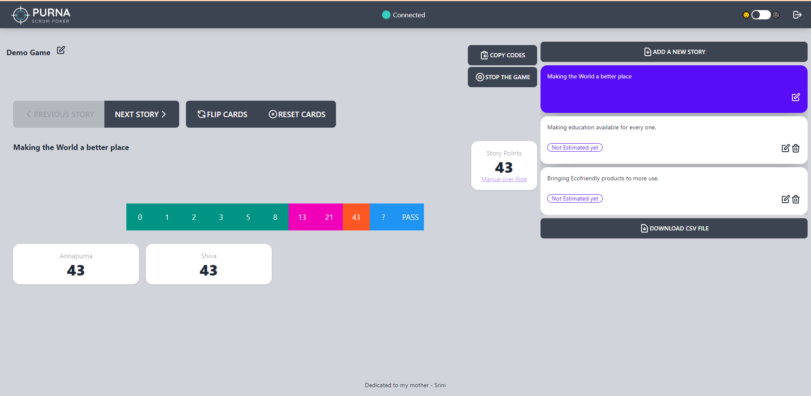

# Purna Scrum Poker

This is open source implementation of Planning poker.

## What is Planning Poker?

This is what [wikipedia](https://en.wikipedia.org/wiki/Planning_poker) Says

> Planning poker, also called Scrum poker, is a consensus-based, gamified technique for estimating, mostly used for timeboxing in Agile principles. In planning poker, members of the group make estimates by playing numbered cards face-down to the table, instead of speaking them aloud. The cards are revealed, and the estimates are then discussed. By hiding the figures in this way, the group can avoid the cognitive bias of anchoring, where the first number spoken aloud sets a precedent for subsequent estimates.

## Screenshots

## Deployment

It is deployed at https://purna-scrum-poker.herokuapp.com/

## Tech Stack

**Client:** React, TailwindCSS, daisyui

**Server:** Java, quarkus, mongodb, websockets, graphql

## Features

- Real-time updates to support effective distributed planning
- Choose from multiple pointing scales to build a sprint that fits your team
- Zero friction onboarding, no need to register, Just create a game and use it.
- Use URL from copy code drop down to directly launch the game without entering game code.
- Edit scores to build team consensus around estimates
- Multiple admins can control the game play
- Export stories to simply manage your sprint
- Dark and light themes.

## Roadmap

- Making Better UI. Mostly making it mobile friendly.
- Making Server scale horizontally

## Contributing

Contributions are always welcome!

See `contributing.md` for ways to get started.

Please adhere to this project's `code of conduct`.

## License

[AGPL 3.0](https://choosealicense.com/licenses/agpl-3.0/)

## Support

For support, email srinivasarajui@gmail.com or raise a bug [here](https://github.com/srinivasarajui/purna-scrum-poker/issues).
